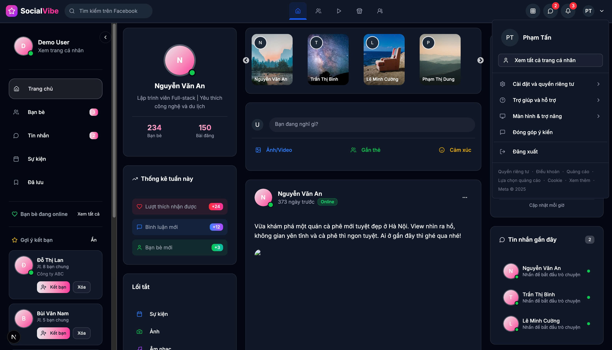

# Social Media Vibe



Xây dựng social media - vibe 

```bash
npm run dev
# or
yarn dev
# or
pnpm dev
# or
bun dev

Feature-based Folder Structure architecture
 npm run build npm run start

src/
├── app/
│   ├── home/
│   │   ├── page.tsx
│   │   └── components/
│   ├── messages/
│   │   ├── page.tsx
│   │   └── components/
│   └── ...
├── components/
│   ├── call/           # Dùng chung nhiều nơi
│   ├── chat/           # Dùng chung nhiều nơi
│   ├── post/           # Dùng chung nhiều nơi
│   ├── layout/         # Header, Sidebar, Footer
│   └── ui/             # Button, Modal, Card, ...
